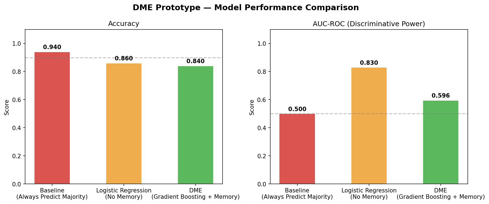
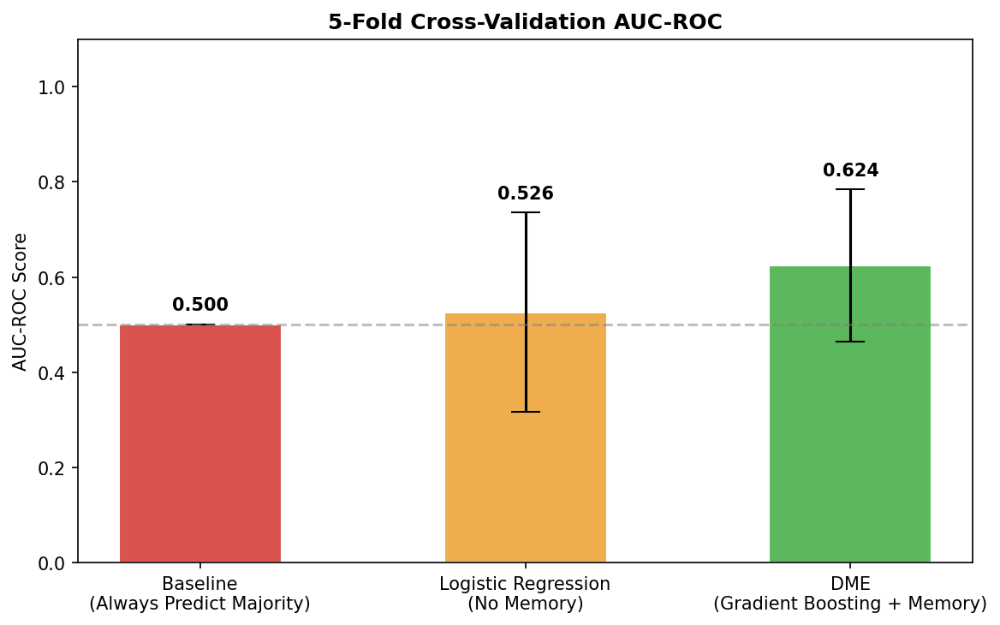
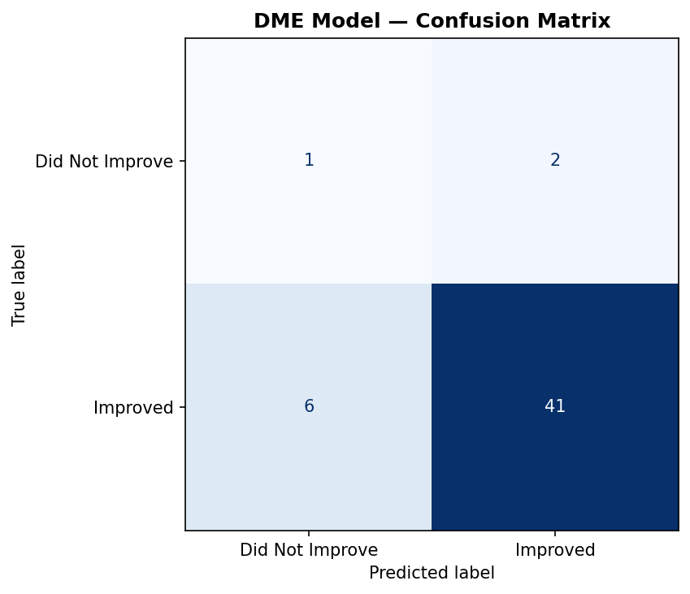

# Decision Memory Engine

A clinical decision-support prototype that combines a trained machine learning risk model, case-based reasoning over a growing decision memory, and an optional large language model advisory layer, all presented as an interactive Streamlit dashboard. It is built on the openly licensed MIMIC-IV demo cohort.


---

## Overview

The Decision Memory Engine helps reason about patient risk and outcomes. It is built around the idea of a decision memory: every decision the system makes is logged, later linked to an outcome, and fed back to improve future predictions. This is a lightweight case-based-reasoning and continual-learning loop.

The system fuses three complementary techniques:

1. **Statistical machine learning.** A gradient boosting classifier trained on the MIMIC-IV demo cohort for outcome prediction and risk scoring.
2. **Case-based reasoning.** Retrieval of historically similar cases from the decision memory to give context to a new case.
3. **Language model advisory.** An optional Llama 3.3 70B layer (served through Groq) for natural-language summaries, differential suggestions, missing-data detection, and a safety and bias review. The system runs fully without it; only the language tabs switch off when no API key is present.

---

## Skills demonstrated

- **Machine learning**: gradient boosting, logistic regression, class-imbalance handling with sample weights, stratified train and test splitting, 5-fold cross validation
- **Model evaluation**: accuracy, ROC-AUC, confusion matrices, cross-validated scores with error bars, comparison against a majority-class baseline
- **Data engineering**: a reproducible pipeline from raw MIMIC-IV tables to processed decision traces, feature engineering, a SQLite decision log
- **Case-based reasoning**: building and querying a similarity index over past decisions
- **Application development**: a five-tab Streamlit dashboard
- **LLM integration**: prompt design and a graceful-degradation pattern so the app works with or without the model
- **Software practices**: modular package layout, environment-based secrets, offline evaluation separated from the live app

---

## The dashboard

| Tab | Capability |
|-----|-----------|
| 1. Clinical Analysis | Enter vitals to get a risk score and an outcome prediction. |
| 2. Deep Analysis | Language-model summary, differentials, and missing-data flags. |
| 3. Decision Memory | Charts of historical cases and model version history. |
| 4. Safety and Bias | Automated data-quality checks and a safety and bias review. |
| 5. AI Assistant | Free-form chat with full patient context. |

---

## Architecture

```
        Streamlit UI (app.py)
        Tab1 Clinical | Tab2 Deep | Tab3 Memory | Tab4 Safety | Tab5 Assistant
                |                 |                        |
        learning_engine     outcome_linker           Language model API
        gradient boosting   links decisions          Llama 3.3 70B
        + CBR index         to outcomes              (optional, via env key)
                |                 |
        decision_logger  ->  SQLite decision store
```

---

## Model evaluation

`evaluation/evaluate.py` compares three approaches on the same data, with a stratified split that preserves the class balance and 5-fold cross validation for a stable estimate:

1. A majority-class baseline, which sets the floor any real model must beat.
2. Logistic regression with balanced class weights, a simple linear model with no memory.
3. The Decision Memory Engine, a gradient boosting model used alongside case-based reasoning.

| | |
|---|---|
|  |  |



---

## Repository structure

```
decision-memory-engine/
├── app.py                    # Streamlit dashboard (five tabs)
├── reset.py                  # reset the decision-memory database
├── modules/
│   ├── learning_engine.py    # train classifier, predict outcome, build CBR index
│   ├── outcome_linker.py     # link completed decision traces to outcomes
│   ├── decision_logger.py    # persist every decision to SQLite
│   ├── feature_pipeline.py   # feature engineering
│   └── setup_db.py           # schema bootstrap
├── evaluation/
│   ├── evaluate.py           # offline model comparison
│   └── results/              # confusion matrix, cross-val and comparison charts
├── models/                   # serialized model artefacts (.pkl)
└── data/                     # raw MIMIC-IV demo, processed traces, and a synthetic generator
```

---

## Getting started

```bash
# 1. Clone
git clone https://github.com/Simaak-Sayed/decision-memory-engine.git
cd decision-memory-engine

# 2. Install dependencies
pip install streamlit scikit-learn pandas numpy matplotlib groq

# 3. Optional: provide a language-model API key via the environment (never hard-code it)
export GROQ_API_KEY="your-key"        # Windows: set GROQ_API_KEY=...

# 4. Run
streamlit run app.py
```

If `GROQ_API_KEY` is not set, the machine learning prediction and decision-memory features still work and only the language-model tabs are disabled.

---

## Data and ethics

- This project uses the **MIMIC-IV Clinical Database Demo** (100 patients), which is openly available on PhysioNet under the Open Data Commons Open Database License. No credentialed or identifiable patient data is included.
- Please cite the MIMIC-IV demo and PhysioNet if you build on this work.
- The language-model API key is read from the environment at runtime, so no secrets are stored in the repository.
- This is a research prototype. It is not a certified medical device and must not be used for real clinical decisions.

---

## License and author

Released under the MIT License. Author: Simaak Haque Fahimuddin Sayed.
